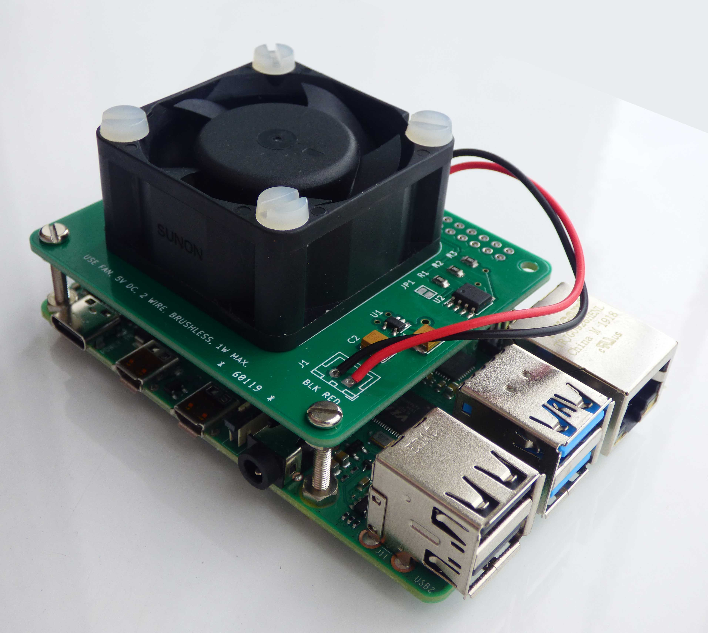
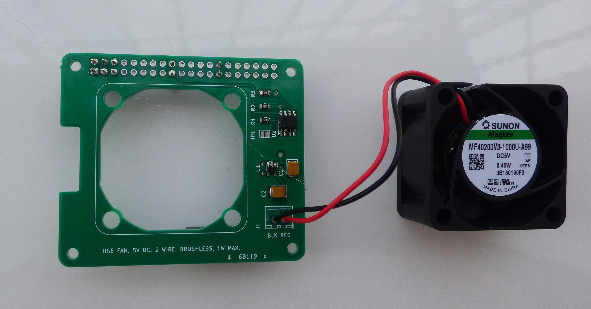
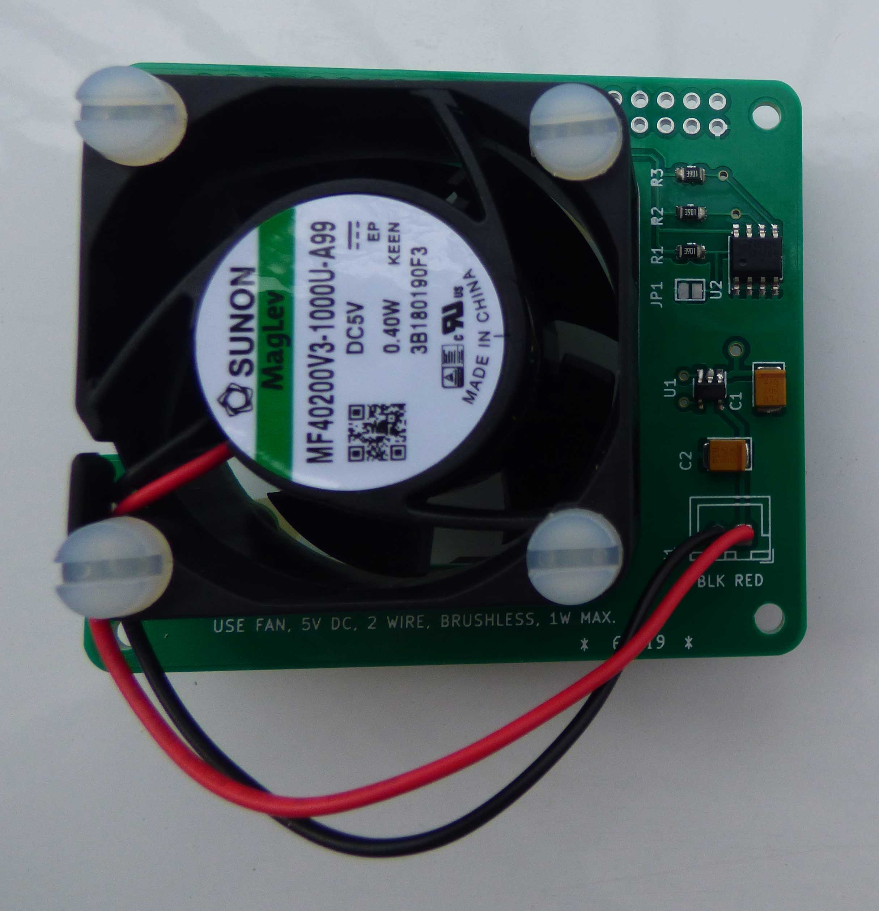

# LTC1695 Raspberry Fan Controller




This is a fan speed controller for the Raspberry Pi. The main advantages are: 

1. small number of components: one IC and two capacitors.
2. low noise

## Hat



The *hat* pcb contains two ic's: U1, an LTC1695 fan controller, and U2, a 24c32 EEPROM. The data in the EEPROM allows Raspbian to identify the hat. If you are making this for yourself, you can safely leave the EEPROM away.  That leaves us with the following components: 

Quant.|Item
---|--
1|LTC1695CS5  I2C Fan Speed Controller, SOT-23
2|KEMET T494B475K020AT Tantalum Capacitor, SMD 20V 4.7uF 1311 10% ESR=1 Ohms
1|Adafruit Accessories Stacking Header for Raspberry Pi
1|Sunon MF40200V3-1000U-A99 DC Fan 40mm, 5V.

That's all. 

## Installation
If you scan the i2c bus, you ought to see the fan controller at address 0x74:
```
koen@raspberrypi:~ $ sudo i2cdetect -r -y 1
     0  1  2  3  4  5  6  7  8  9  a  b  c  d  e  f
00:          -- -- -- -- -- -- -- -- -- -- -- -- -- 
10: -- -- -- -- -- -- -- -- -- -- -- -- -- -- -- -- 
20: -- -- -- -- -- -- -- -- -- -- -- -- -- -- -- -- 
30: -- -- -- -- -- -- -- -- -- -- -- -- -- -- -- -- 
40: -- -- -- -- -- -- -- -- -- -- -- -- -- -- -- -- 
50: -- -- -- -- -- -- -- -- -- -- -- -- -- -- -- -- 
60: -- -- -- -- -- -- -- -- -- -- -- -- -- -- -- -- 
70: -- -- -- -- 74 -- -- --                         
koen@raspberrypi:~ $ 
```
You can switch the fan completely on:
```
i2cset -y 1 0x74 63
```
completely off
```
i2cset -y 1 0x74 0
```
or something in between
```
i2cset -y 1 0x74 32
```
At low speeds, the fan might need a little extra push to get going. If you add 64 to the speed the fan will run at full speed for 0.25s, then slow down to the normal speed. As an example
```
i2cset -y 1 0x74 84
```
runs the  fan at the full 5V for a quarter second to get the fan moving, then drops to 1.56V for normal operation.

Lastly, you can read the fan controller status:
```
i2cget -y 1 0x74 
```

Value | Status
--------|--------
0|ok
64|thermal shutdown (T > 155 degree C)
128|overcurrent (I > 390mA)
192|thermal shutdown *and* overcurrent

## Running

The *raspbian* directory contains *fanctl.py*, a python script which you can run either interactively or in the background. The values for *fan_min* and *fan_boost* are for the fan I'm using. The values  *temp_min* and *temp_max* represent personal choices. Feel free to modify the script as you wish. Once you are happy with the values, you can add the fan controller to *etc/rc.local* so the fan starts up at boot:
```
/usr/local/bin/fanctl.py &
```